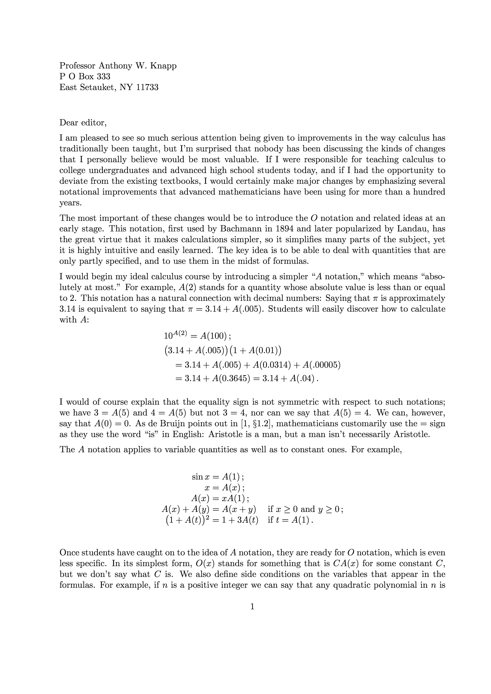
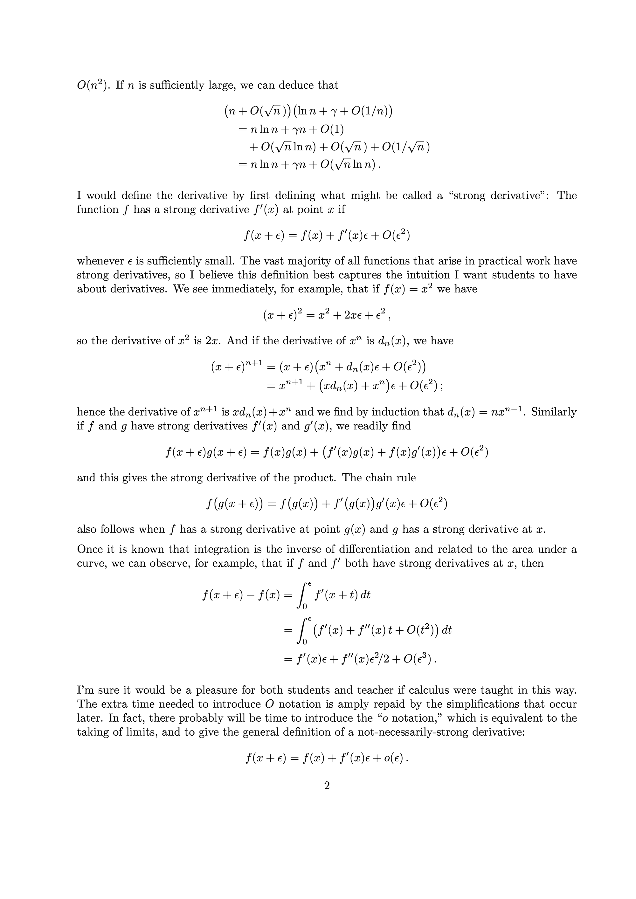
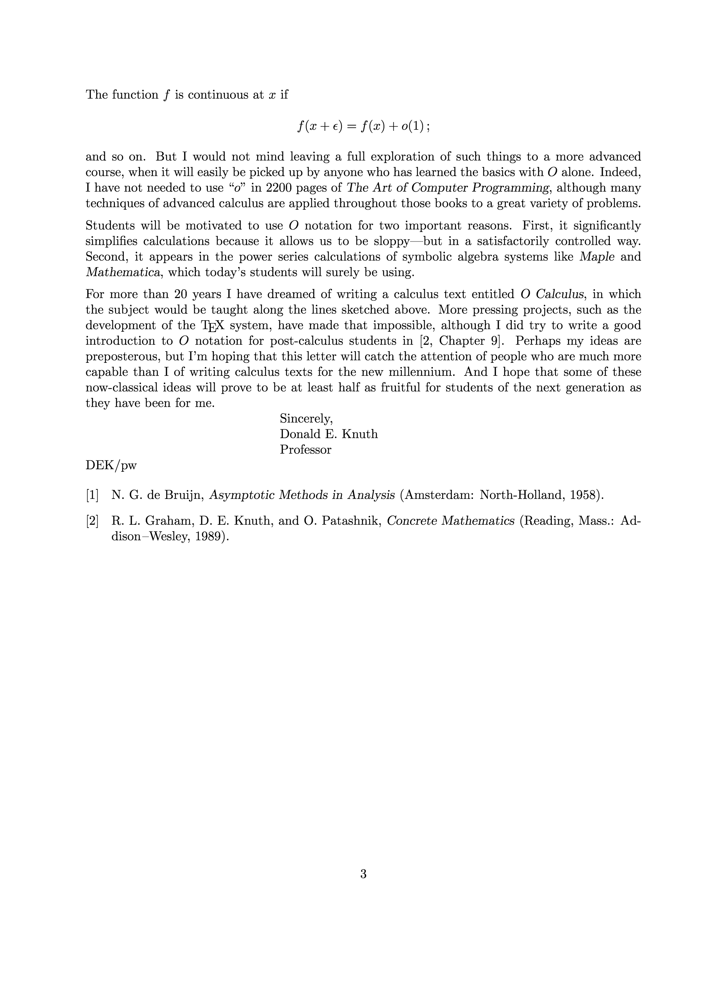

#  Knuth's big _O_ Calculus

For more than 20 years I have dreamed of writing a calculus text entitled _O Calculus_...

-- _Donald Knuth_, "Teach Calculus with Big _O_", [Notices of the AMS, June/July 1998, p. 687-688](https://www.ams.org/notices/199806/commentary.pdf).   

So you've searched for "O Calculus"; excited to see what has come out of Donald Knuth's Proposal... and here you are.  Nothing has come out.. yet.  But maybe the Open Source Community can do something about that?  

---
# How to contribute

If you have the skills and time to start developing the book, please let's get together and start.  

If you don't have the skills / time at hand, consider starring this repo, and please post "+1" on [issue 1](https://github.com/Alex-Linhares/Knuths-O-Calculus/issues): How many like Knuth's proposal?  Maybe we reach a critical mass of people who will get the ball going? Maybe this goes viral?  Who knows?  I henceforth create this repo as a message on a bottle, hoping it will reach _you_, the person who, like me, think something like _O Calculus_ must exist.

Donald Knuth's Proposal
---

    
  
  
  

* in [NOTICES OF THE AMS, June/July 1998, p. 687-688](https://www.ams.org/notices/199806/commentary.pdf)  
* [Full text](/big-Oh-Calculus.pdf) from in [Knuth's page](https://www-cs-faculty.stanford.edu/~knuth/calc)  
* being discussed on the web:  
    [in 2008](https://micromath.wordpress.com/2008/04/14/donald-knuth-calculus-via-o-notation/)  
    [in hacker news, 2008](https://news.ycombinator.com/item?id=163177)  
    [in 2011](https://texnicalstuff.blogspot.com/2011/05/big-o-notation-for-calculus.html)  
    
